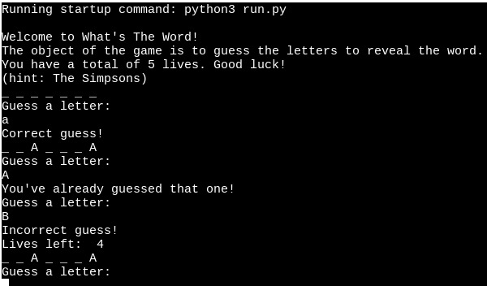
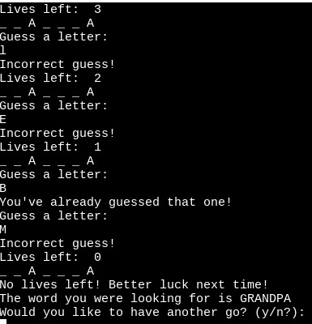
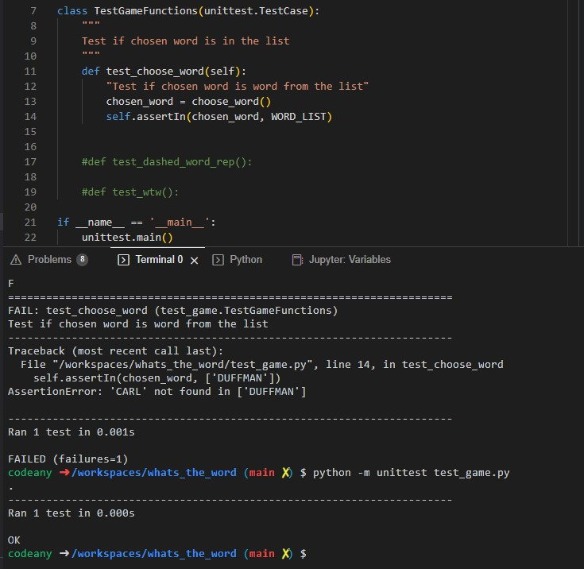
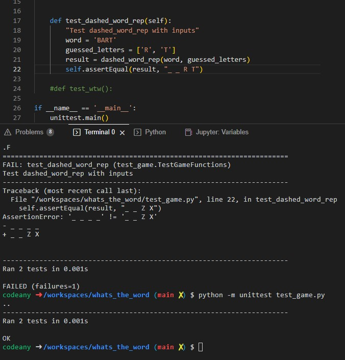
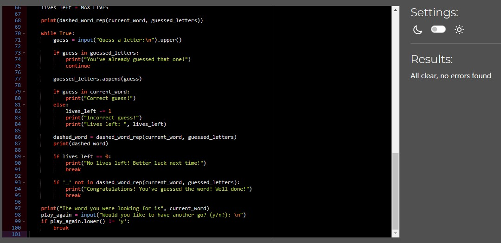

# What's The Word!

What's The Word is a Python terminal game, which runs in the Code Institute mock terminal on Heroku.

Users try to guess the letters in order to reveal the hidden word before all of their five lives run out.

[Click here to go to my live project](https://whats-the-word-e1699aaf9ca6.herokuapp.com/)

## How To Play

When game loads player is prompted to is greeted with a message and is given a hint before being prompted to make a guess at the first letter.

Player inputs guess and is told informed that they are successful or unsuccessful or that the guess has been made already.

This continues until the word is revealed or the player has used up all five lives.

When the game ends the player is given the option to play again by entering "y" for yes or "n" for no.

## Features

### Existing Features

- Randomly selects a word from a predined list of characters from The Simpsons.

- Displays a dashed representation of the chosen word with underscores representing unguessed letters.

- Allows the player to guess a letter.

- Checks if the guess is correct, incorrect or a repeat guess.

- Updates the guessed letters and number of lives left.

- Provides feedback on the guess and the remaining lives.

- Continues the game until the player runs out of lives or guesses the word.

- Hidden word revealed if player does not guess correctly.

- Prompts player to decide whether to play again or not whenthe game is finished.

### Future Features

- Expanded lists and categories or themes.

- A scoring system and leaderboard.

## Data Structure

- _WORD_LIST_: This is a list that contains the words (characters from The Simpsons) that the game randomly selects. The words are stored as strings.

- _guessed_letters_: It is a list that keeps track of all of the guessed letters. It is used to check if a letter has already been guessed and to update the dashed representation of the word.

- _current_word_: A string that represents the randomly chosen word for the current game session. It is selected from the WORD_LIST using random selection.

- _dashed_word_: A string that is created by the _dashed_word_rep_ function to display the current state of the word being guessed, with dashes representing unguessed letters.

Overall the data model in the game is primarily consisting of lists and strings to store and manipulate the words, guessed letters and dashed representation of the words.

## Testing

I have manually tested the project by doing the following:

### Test Choose_Word:

- Failed: Tested for individual word from WORD_LIST but as function chooses a random word from the list the test failed.

- Passed: Changed the individual name selected from the WORD_LIST and instead supplied the variable WORD_LIST. Test passed.

### Test Dashed_Word_Rep:

- Failed: Tested with incorrect inputs for chosen word and test failed.

- Passed: Changed to correct inputs and both correct inputs were displayed alongside dashed representations of the yet to be guessed letters.

### Test WTW:

- Failed: Tested to see if 2 print statements were called when fucntion was executed. Test failed as there is 3 print statements.

- Passed: Tested with correct number of print statements. Test passed.

 - Passed the code through a PEP8 Python Validator.

 - Given duplicate input to receive feedback pointing this out.

 - Tested in my local terminal and the Code Institute Heroku terminal.

 ## Bugs

 There are no bugs in the code.

 ## Validator Testing

 Tested through Code Institute Python Linter - all clear, no errors found.

 

 ## Deployment

  - Steps for deployment:

     - Clone repository.

     - Create a new Heroku app.

     - Set the _Buildpacks_ to Python and _nodeJS_.

     - Set _key_ to PORT and _value_ to 8000.

     - Link Heroku app to Github repository.

     - Deploy

## Credits

 - Code Institute for Heroku terminal.

 - Mentor for guidance with structure and code.

 - Google and WC3 Schools with code.